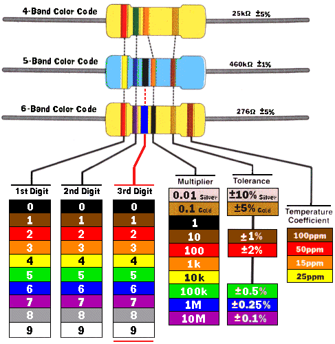

# Arduino: Nivel avanzado

## José Antonio Vacas @javacasm
## Organiza: Darwin Eventur
## BiblioMaker - Facultad de Ciencias
## 23 al 27 de Septiembre de 2019

## http://bit.ly/ArduinoAvanzado19

* * *

# Extras

## Placa de prototipo

## Código de color de las resistencias

## [Guia del kit Inven](./GUIA INVENKIT 2016.pdf)

## [Chuleta Arduino](./Funciones.pdf)

## [Guía de arduino](./Arduino_programing_notebook_ES_completo.pdf)
