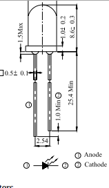

# Arduino: Nivel avanzado 3ed

## José Antonio Vacas @javacasm
## Organiza: [Darwin Eventur](https://www.darwineventur.com/2019/07/arduino-avanzado-3a-edicion.html)
## BiblioMaker - Facultad de Ciencias
## 23 al 27 de Septiembre de 2019

## http://bit.ly/ArduinoAvanzado19

## Comunicaciones infrarrojas

Una de las formas más habituales de control remoto de dispositivos sobre todo en el entorno doméstico son los controles infrarrojos. Casi todos los mandos a distancia domésticos los utilizan. Existen varios protocolos (casi tanto como fabricantes) de comunicaciones infrarrojas https://en.wikipedia.org/wiki/Infrared_remote_control.

Utilizan luz infrarroja de 940 nm de longitud de onda, modulándolo con una onda de 38kHz. El hardware necesario para utilizar estas comunicaciones es extremadamente barato. El único inconveniente que tiene es que es muy susceptible a interferencia por luces o por el sol.

Para realizar la comunicación necesitaremos un emisor

Y un receptor

Los montajes eléctricos son muy sencillos. Para el emisor:

Y el montaje para el receptor (hay que ver el patillaje concreto de nuestro modelo)

Para controlarlo con Arduino la forma más sencilla es usar la librería IRremote.

Ejemplo de código para enviar códigos para encender una TV de marca Sony (emisor en el pin 12)

      #include <IRremote.h>

      IRsend irsend;

      // Sony TV power code
      irsend.sendSony(0xa90, 12);

Código para recibir códigos (receptor en pin 11) y mostrarlos por el monitor Serie

    #include <IRremote.h>

    int RECV_PIN = 11;

    IRrecv irrecv(RECV_PIN);

    decode_results results;

    void setup()
    {   Serial.begin(9600);
      irrecv.enableIRIn(); // Start the receiver}

    void loop() {
      if (irrecv.decode(&results)) {
        Serial.println(results.value, HEX);
        irrecv.resume(); // Receive the next value   }
    }

En el [siguiente vídeo](https://www.youtube.com/embed/S-wWNDfEPqw) vemos todo esto en detalle
