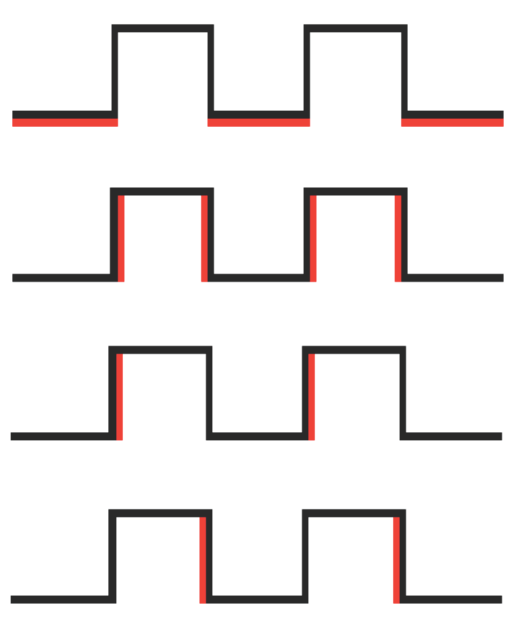

## Interrupciones hardware

Para que se produzca una interrupción hardware, el microcontrolador debe disponer de una electrónica capaz de hacerlo.

Los microcontroladores utilizados en Arduino (ATMega) disponen de varias patillas capaces de generar interrupciones hardware ante cambios de su estado.

En concreto en arduino UNO, las interrupciones externas llamadas INT0 e INT1 están asociadas a los pines 2 y 3. El Arduino Mega tiene otras 4: 2 (pin 21), 3 (pin 20), 4 (pin 19) y 5 (pin 18) )

Podemos configurarlas dependiendo del cambio de estado como

* estado bajo -> LOW
* cambio -> CHANGE
* de subida  -> RISING
* de bajada  -> FALLING

Para activar una interrupción sólo tenemos que llamar al método attachInterrupt con el  número de interrupción a usar, la función a la que se llamará cuando se produzca y el tipo de cambio a detectar

Veamos un ejemplo donde hemos conectado un led al pin 11 (con su resistencia) y un pulsador en el pin 2 (interrupción hardware 0)

    const int  led_pin = 11;
    int estado = LOW ;

    void setup() {
    pinMode(led_pin,OUTPUT);
    // configuramos interrupcion
    attachInterrupt(0 ,parpadeo , CHANGE  ); // Pin 2
    }

    void loop() {
       digitalWrite(led_pin , estado);
    }

    // Funcion que se llamara en la interrupcion
    void parpadeo(){
      if(estado == HIGH ) {  // estado = !estado;
        estado = LOW ;
      } else {
        estado = HIGH;
      }
    }

Donde vemos que la función parpadeo se encarga de cambiar el estado del pin cada vez que pulsamos el pulsador

Podríamos estar tentados de mover la llamada de digitalWrite al método parpadeo. Lo hemos dejado así por 2 razones:

* El código ejecutado en las funciones de las interrupciones debe ser lo más corto posible. No olvidemos que estamos interrumpiendo el código "central"

* Así demostramos que estamos haciendo parte del procesamiento en 2 sitios distintos

Hay que tener cuidado con los cambios que se hacen a las variables en una interrupción pues podrían entrar en conflicto con los valores que tenían, por eso se marcan esas variables como "volatile" para el compilador lo tenga en cuenta.

Vamos a añadir al ejemplo un contador que se incrementará con cada pulsación

    const int  led_pin = 11;
    int estado = LOW ;
    volatile int contador = 0;

    void setup() {
       Serial.begin(9600);
       pinMode(led_pin,OUTPUT);
       // configuramos interrupcion
       attachInterrupt(0 ,parpadeo , CHANGE  ); // Pin 2

    }

    void loop() {
       digitalWrite(led_pin , estado);
       Serial.println(contador);
       delay(100);
    }

    // Funcion que se llamara en la interrupcion
    void parpadeo(){
      if(estado == HIGH ) {  // estado = !estado;
        estado = LOW ;
      } else {
        estado = HIGH;
      }
      contador = contador +1;
    }

Los micro ATMega tienen muchas más posibilidades de interrupciones, pero no todas están soportadas por arduino. En [esta página](https://sites.google.com/site/qeewiki/books/avr-guide/external-interrupts-on-the-atmega328) hablan de ello.

En el [siguiente vídeo](https://www.youtube.com/embed/n5tkYR5PT0c) se habla de interrupciones hardware.
