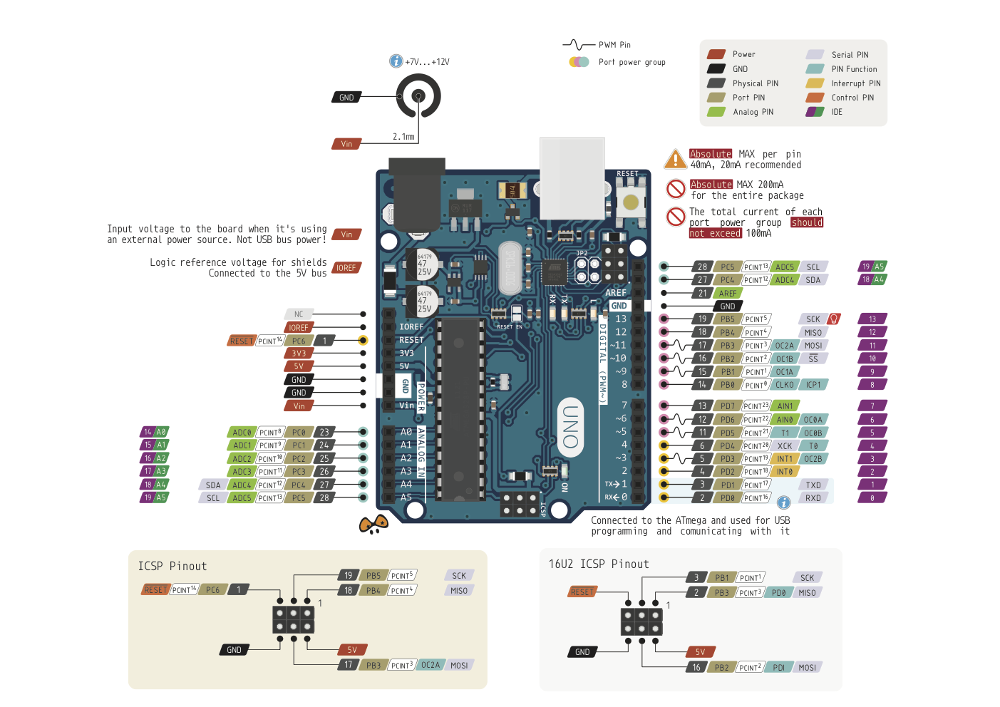
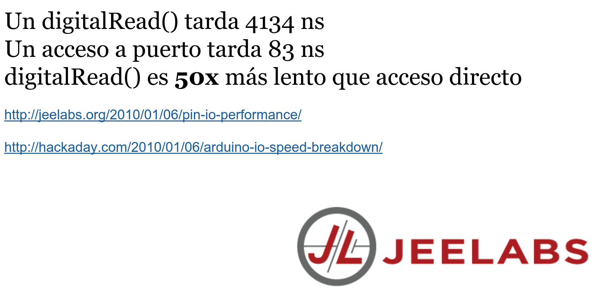
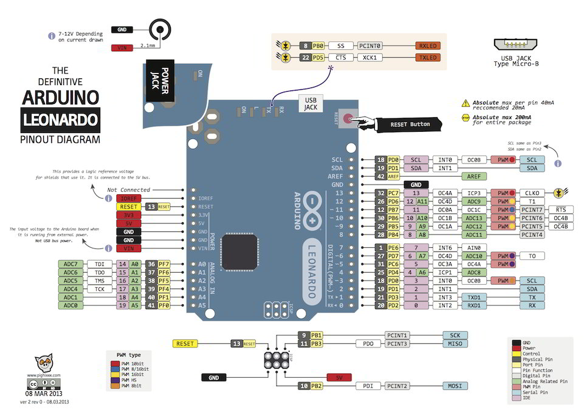
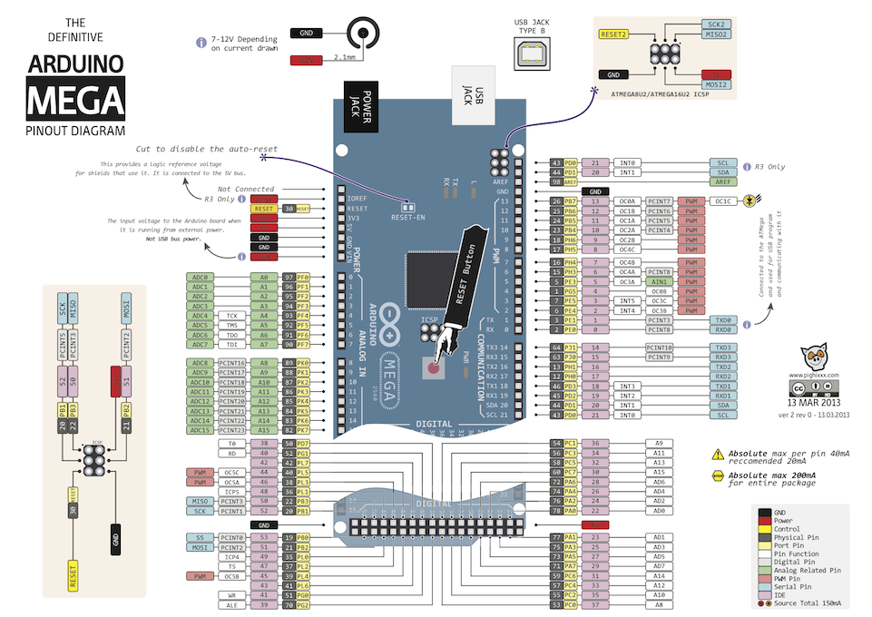
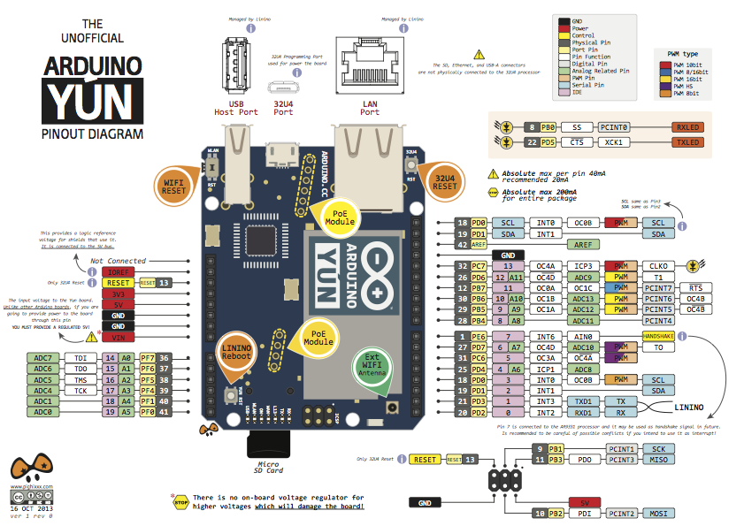
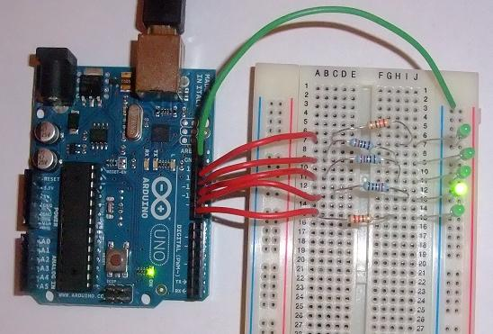

## Uso avanzado de puertos

Hasta ahora todo el acceso a los puertos que hemos hecho ha sido usando las instrucciones  digitalWrite o digitalRead. Con ella sólo podíamos acceder a un pin al mismo tiempo, es decir para hacer varias acceso a diferentes pines teníamos que hacer diferentes llamadas.

Son muchas las ocasiones en las que es necesario el acceder simultáneamente a varios pines como por ejemplo cuando estamos usando muchos leds. O bien cuando accedemos a los bits y podríamos realizar operaciones matemáticas de una forma sencilla para obtener los resultados.

Por otro lado, internamente todos los pines de los microcontroladores están organizados en diferentes palabras o registros.

Por ejemplo, en  Arduino UNO las E/S en los microcontroladores están agrupadas en puertos
* B (digital pin 8 to 13)
* C (analog input pins)
* D (digital pins 0 to 7)

Cada puerto está controlado por 3 registros donde cada bit representa a un pin
* DDR  que define si el pin es INPUT o  OUTPUT
* PORT que define el estado en caso de que sea pin de salida HIGH o  LOW
* PIN  que define el estado en caso de que sea entrada INPUT

Otra ventaja que tiene acceder de esta manera que es que el acceso es mucho más rápido.

Se propone realizar como práctica: midiendo la velocidad de acceso directo a puertos y de digitalwrite

Veamos la estructura de los pines de un Arduino UNO

Para un arduino Leonardo el diagrama es parecido aunque con diferencias, como por ejemplo los pines SDA y SCL y sobre todo la disposición e los pines de puerto agrupados

Y no podía faltar el esquema para el Arduino Mega

Arduino Yun

(Esquemas del gran Alberto Piganti @pighixxx)

En el [siguiente vídeo](https://www.youtube.com/embed/xkSOt-tlCmM) vamos a ver cómo usar los pines por medio de los registros

### Más detalles

* PORTD  Arduino digital pins 0 to 7
  * DDRD  - Port D Data Direction Register - read/write
  * PORTD - Port D Data Register - read/write
  * PIND -  Port D Input Pins Register - read only

* PORTB  Arduino digital pins 8 to 13
  * DDRB -  Port B Data Direction Register - read/write
  * PORTB - Port B Data Register - read/write
  * PINB -  Port B Input Pins Register - read only

* PORTC  Arduino analog pins 0 to 5. Pins 6 & 7 sólo en Arduino Mini
  * DDRC - Port C Data Direction Register - read/write
  * PORTC - Port C Data Register - read/write
  * PINC - Port C Input Pins Register - read only

[Referencia](http://www.arduino.cc/en/Reference/PortManipulation)

### Ejemplo sencillo

Hemos dicho que PortD mapea los digital pins 0 to 7 (pins 0 & 1 son TX y RX)

DDRD es la dirección del Port D (Arduino digital pins 0-7) controla si PORTD se configura como entrada o salidas

Si en nuestro código hacemos

    DDRD = B11111110; // 1 to 7 as outputs, pin 0 as input

Estaremos haciendo que los pines 1-7 sean salidas y el 0 entrada

Si ahora hacemos

    PORTD = B10101000; // ponemos los pin 7,5,3 HIGH

Estamos poniendo los pines 7,5 y 3 en estado alto

Hay que tener cuidado con los pines 0 y 1 puesto que si los manipulamos con el registro PORTD podemos producir problemas de comunicación puesto que son los pines que se encargan de ello

Vamos a hacer ahora el tipico ejemplo del "coche fantástico o Kit", donde vamos desplazando el led encendido entre los 5 disponibles

Antes vamos a un truco matemático que se usa mucho. El operador << nos permite rotar hacia la derecha el valor de un registro.

Si tenemos el valor 1 (B00000001 en binario) y lo rotamos 1 vez tendremos B00000010 (que en decimal equivale al valor 2)

Si queremos hacer que nuestro led "se deplace", sólo tenemos que rotar el valor 1 un cierto número de veces.

El resultado de este operador es multiplicar por 2 el valor orignal

Del mismo modo existe el operador >> que rota en sentido contrario  y que equivale a dividir por 2.

El [código](https://github.com/javacasm/ArduinoCompletoDE2018/blob/master/material/codigo/CylonInterrupcionesHardware.ino) sería

        unsigned char upDown=1;  // Indica si vamos hacia arriba o hacia abajo

        unsigned char cylon=0; // será el led que encendemos de 0 a 4

        void setup() {
            DDRB = B00011111; // Arduino port B pines 0 to 4 como salida
        }

        void loop() {
          if ( upDown == 1 ) { // Vamos hacia arriba
            cylon++;  // Pasamos al siguiente
            if(cylon>=4) {  // Si llegamos a 4 tenemos que empezar a ir hacia abajo
                upDown=0;
            }
          } else {
            cylon--;  // Vamos hacia abajo
            if ( cylon == 0 ) {  // Si llevamos abajo (0) empezamos a subir
              upDown=1;
            }

          }
          PORTB = 1 << cylon; // Rotamos a la derecha determinado numero de veces el led
          delay(150); // Esperamos un poquito

        }
