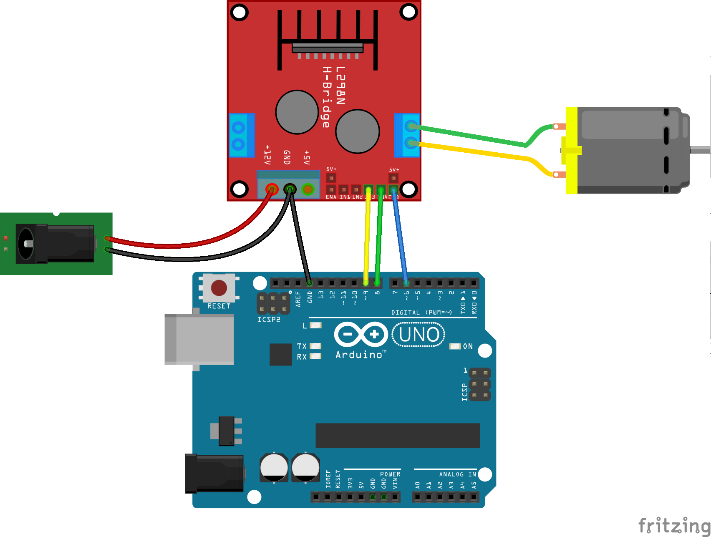

### Motores

Existen diferentes tipos de motores según queramos velocidad o precisión de movimiento. Cada uno de estos tipos tiene sus características y se controla de diferente manera.

En [este vídeo](https://www.youtube.com/embed/X16wCRL1F0s) vamos a ver también un resumen de los diferentes tipos de motores disponibles

Para controlarlos se suelen usar módulos o shiedls. Veamos algunos de ellos y cómo usarlos en [este vídeo](https://www.youtube.com/embed/8EddjPe2ZVk)

### Motores de corriente continua (CC)

Son los típicos motores que suelen venir en los juguetes y que se alimentan con corriente continua. Tienen la característica que si se les da más potencia (más voltaje o un % de PWM mayor) giran más deprisa.

Para controlarlos se suele usar un driver de tipo L298 o L293

Veamos como se hace con el L298, capaz de controlar 2 motores, aunque nosotros en el esquema solo usamos 1

Para controlarlo usaremos los pines IN3 y IN4 con los controlaremos la dirección de giro del motor y el EnB que nos permitirá controlar la velocidad.

Este sería el código

    // Variables globales

    const int EnB=6;
    const int In3=9;
    const int In4=8;

    // Valores de velocidad maxima y minima
    const int Max_Speed=255;
    const int Min_Speed=0;

    void setup() {
      pinMode(In3,OUTPUT);  // Establecemos los pines In3 e In4 como salida
      pinMode(In4,OUTPUT);
    }
    // Establece la velocidad con el valor del PWM del pin EnB
    void setSpeed(int speed){
      analogWrite(EnB,speed);
    }

    // Arrancamos a maxima velocidad
    void start(){
        analogWrite(EnB,Max_Speed);
    }

    // Paramos el motor
    void stop(){
       analogWrite(EnB,Min_Speed);
    }

    // El motor gira en sentido horario
    void clockWise(){
      digitalWrite(In3,HIGH);
      digitalWrite(In4,LOW);
    }

    // El motor gira en sentido antihorario
    void antiClockWise(){
      digitalWrite(In3,LOW);
      digitalWrite(In4,HIGH);
    }

    void loop() {
      clockWise();
      // Vamos aumentando la velocidad
      for(int i=0;i<=255;i+=5){
        setSpeed(i);
        delay(200);  
      }
      stop();
      delay(1000);
      antiClockWise();
      // Vamos aumentando la velocidad
      for(int i=0;i<=255;i+=5){
        setSpeed(i);
        delay(200);  
      }
      stop();
      delay(1000);
    }

### Motores paso a paso (steppers)

En [este vídeo](https://www.youtube.com/embed/wYrhoYnbLmo) hablamos de los motores paso a paso o Steppers

Son muchas las librerías que existen para ayudarnos a manejar los motores paso a paso
Enlaces a librerías
* [Stepper](http://arduino.cc/en/Reference/Stepper)
* [AFMotor](http://learn.adafruit.com/adafruit-motor-shield)
* [AccellStepper](http://www.airspayce.com/mikem/arduino/AccelStepper/) , con unas característica como que permite acelerar (ahorrando consumo) y funcionamiento asíncrono

Un problema que nos encontramos a veces es que no conocemos la estructura interna y el cableado de un motor paso a paso. Veamos [un vídeo sobre cómo averiguar la estructura interna de un motor paso a paso](https://www.youtube.com/embed/ynLkdyOZYmk)

Veamos un ejemplo de control de un stepper

Para hacerlo girar podríamos usar una secuencia adecuada de digitalWrites (como hacen en [este ejemplo](https://raw.githubusercontent.com/osoyoo/Osoyoo-development-kits/master/Osoyoo%20lessons%20for%20Arduino/Stepper.zip))

O podemos usar la librería Stepper

      #include <Stepper.h>

      int in1Pin =11;
      int in2Pin =10;
      int in3Pin =9;
      int in4Pin =8;

      Stepper motor(512, in1Pin, in2Pin, in3Pin, in4Pin);

      void setup()
      {
        pinMode(in1Pin, OUTPUT);
        pinMode(in2Pin, OUTPUT);
        pinMode(in3Pin, OUTPUT);
        pinMode(in4Pin, OUTPUT);

        Serial.begin(9600);
        motor.setSpeed(20);
      }

      void loop()
      {
        if(Serial.available())
        {
          int steps =Serial.parseInt();
          motor.step(steps);
        }
      }

O controlar su velocidad con un potenciómetro

    #include <Stepper.h>

    #define STEPS 512

    Stepper stepper(STEPS, 8, 10, 9, 11);

    int Pval = 0;
    int potVal = 0;

    void setup() {
      Serial.begin(9600);
      stepper.setSpeed(200);
    }

    void loop() {

      potVal = map(analogRead(A0),0,1024,0,500);
      if (potVal>Pval)
        stepper.step(5);
      if (potVal<Pval)
        stepper.step(-5);

      Pval = potVal;

      Serial.println(Pval); //for debugging
    }

28BYJ-48:
* pequeño
* barato (5$)
* 5v (hasta 12v)
* con reducción *approximadamente* 64:1
  

|Motor Type|	Unipolar stepper motor|
| --|--|
|Connection Type|	5 Wire Connection (to the motor controller)|
|Voltage|	5-12 Volts DC|
|Frequency|	100 Hz|
|Step mode|	Half-step mode recommended (8 step control signal sequence)
|Step angle|	Half-step mode: 8 step control signal sequence (recommended) 5.625 degrees per step / 64 steps per one revolution of the internal motor shaftFull Step mode: 4 step control signal sequence 11.25 degrees per step / 32 steps per one revolution of the internal motor shaft|
|Gear ratio|	Manufacturer specifies 64:1. Some patient and diligent people on the Arduino forums have disassembled the gear train of these little motors and determined that the exact gear ratio is in fact 63.68395:1. My observations confirm their findings. These means that in the recommended half-step mode we will have:64 steps per motor rotation x 63.684 gear ratio = 4076 steps per full revolution (approximately).|
|Wiring to the ULN2003 controller|	A (Blue), B (Pink), C (Yellow), D (Orange), E (Red, Mid-Point)|
|Weight|	30g|

## código

Usaremos la librería [AccelStepper](http://www.airspayce.com/mikem/arduino/AccelStepper/)

	#include <AccelStepper.h>
	#define HALFSTEP 8

	// Motor pin definitions
	#define motorPin1  3     // IN1 on the ULN2003 driver 1
	#define motorPin2  4     // IN2 on the ULN2003 driver 1
	#define motorPin3  5     // IN3 on the ULN2003 driver 1
	#define motorPin4  6     // IN4 on the ULN2003 driver 1

	// Initialize with pin sequence IN1-IN3-IN2-IN4 for using the AccelStepper with 28BYJ-48
	AccelStepper stepper1(HALFSTEP, motorPin1, motorPin3, motorPin2, motorPin4);

	void setup() {
	  stepper1.setMaxSpeed(1000.0);
	  stepper1.setAcceleration(100.0);
	  stepper1.setSpeed(200);
	  stepper1.moveTo(20000);

	}//--(end setup )---

	void loop() {

	  //Change direction when the stepper reaches the target position
	  if (stepper1.distanceToGo() == 0) {
	    stepper1.moveTo(-stepper1.currentPosition());
	  }
	  stepper1.run();
	}

Resumido de [aquí](http://42bots.com/tutorials/28byj-48-stepper-motor-with-uln2003-driver-and-arduino-uno/)

### Referencia

En [este enlace](http://www.solarbotics.net/library/pieces/parts_mech_steppers.html) se habla sobre motores paso a paso o steppers.

[Control de un stepper barato](https://www.luisllamas.es/motor-paso-paso-28byj-48-arduino-driver-uln2003/)

[Sobre motores](https://aprendiendoarduino.wordpress.com/2016/07/04/motores/)
