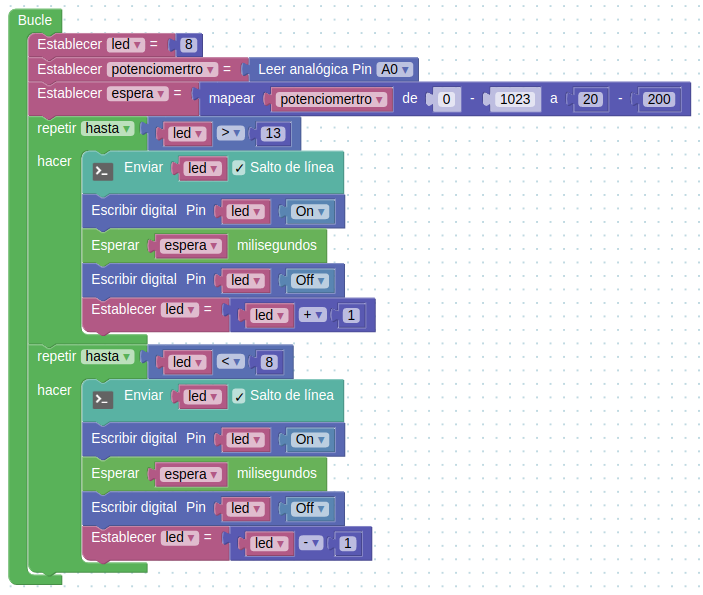

# Arduino: Nivel avanzado 3ed

## José Antonio Vacas @javacasm
## Organiza: Darwin Eventur
## BiblioMaker - Facultad de Ciencias
## 23 al 27 de Septiembre de 2019

## http://bit.ly/ArduinoAvanzado19

* * *

# Proyectos

## Termostato

### 1. Medimos la temperatura y enviamos el valor medido al PC 

### 2. Añadimos control sobre la temperatura, encenderemos un relé que se activará según el valor de la temperatura

### 3. Añadimos una pantalla LCD para poder ver el valor de la temperatura y humedad, creamos una variable para simplificar

### 4. Aprovechamos para ver los valores de humedad

### 5. Añadimos un potenciómetro para fijar el valor de la temperatura objetivo

## Ediciones anteriores

### [Semáforo usando constantes (defines)](./proyectos/Semaforo_define/Semaforo_define.ino)

### [KITT](proyectos/kitt/kitt.ino)

### [Kitt utilizando un array](./proyectos/kitt_array/kitt_array.ino)

### [KITT con velocidad regulable](.proyectos/kitt_regulable_miEspera/kitt_regulable_miEspera.ino)

### [KITT regulable en velocidad y brillo](./proyectos/kitt_regulable_miEspera_ldr/kitt_regulable_miEspera_ldr.ino)

## Creando colores con Led RGB 

Usare 3 sensores analógicos para controlar los nivels de brillo de un led RGB

## Controlando un servo

