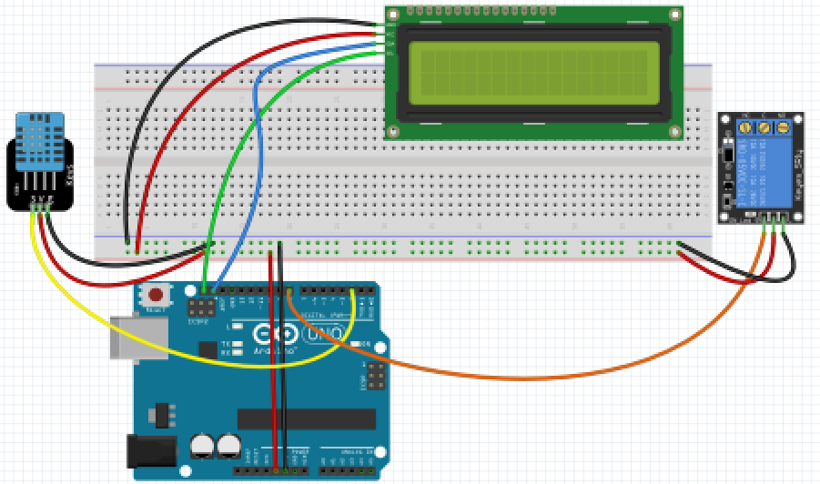

# Arduino: Nivel avanzado 3ed

## José Antonio Vacas @javacasm
## Organiza: Darwin Eventur
## BiblioMaker - Facultad de Ciencias
## 23 al 27 de Septiembre de 2019

## http://bit.ly/ArduinoAvanzado19

* * *

# Proyectos

## Termostato

1. Medimos la temperatura y enviamos el valor medido al PC 

## Ediciones anteriores

### [Semáforo usando constantes (defines)](./proyectos/Semaforo_define/Semaforo_define.ino)

### [KITT](proyectos/kitt/kitt.ino)

### [Kitt utilizando un array](./proyectos/kitt_array/kitt_array.ino)

### [KITT con velocidad regulable](.proyectos/kitt_regulable_miEspera/kitt_regulable_miEspera.ino)

### [KITT regulable en velocidad y brillo](./proyectos/kitt_regulable_miEspera_ldr/kitt_regulable_miEspera_ldr.ino)

