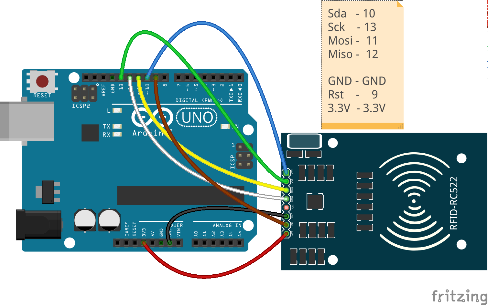
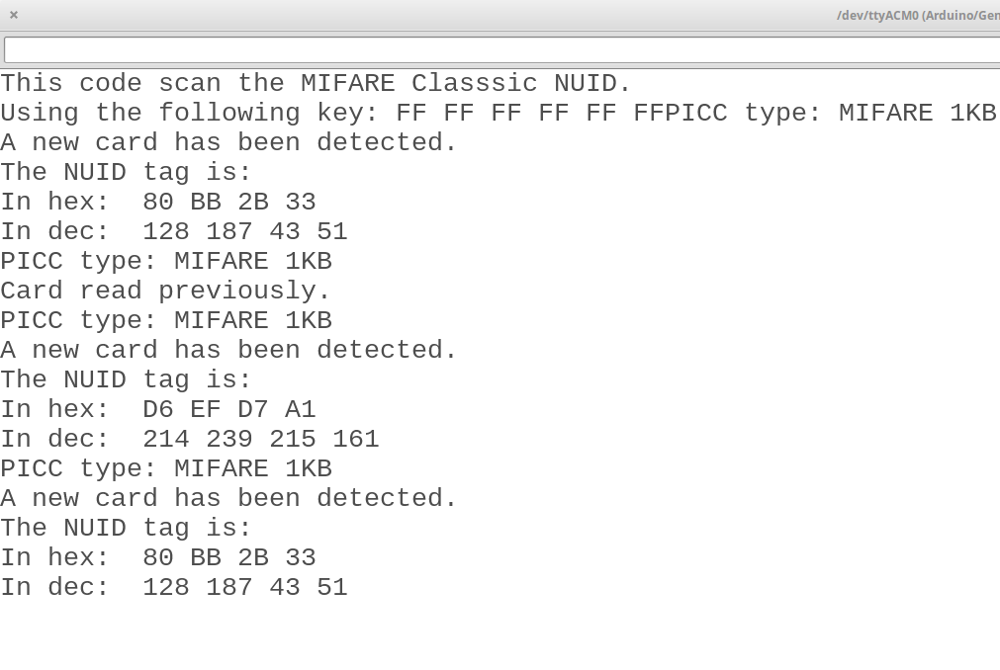
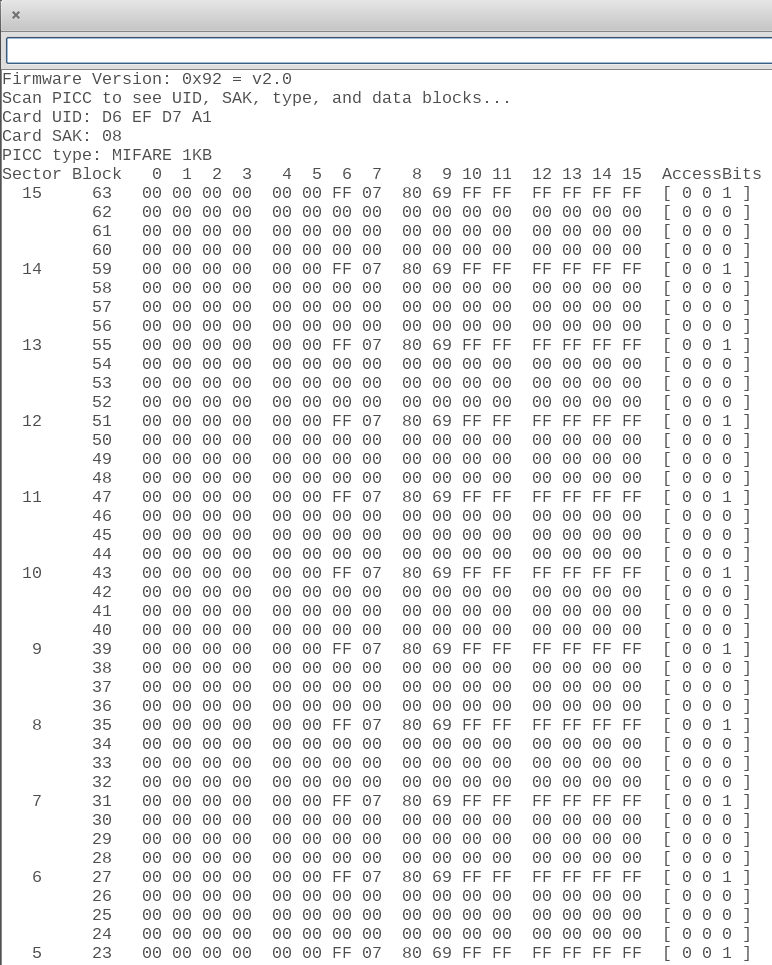
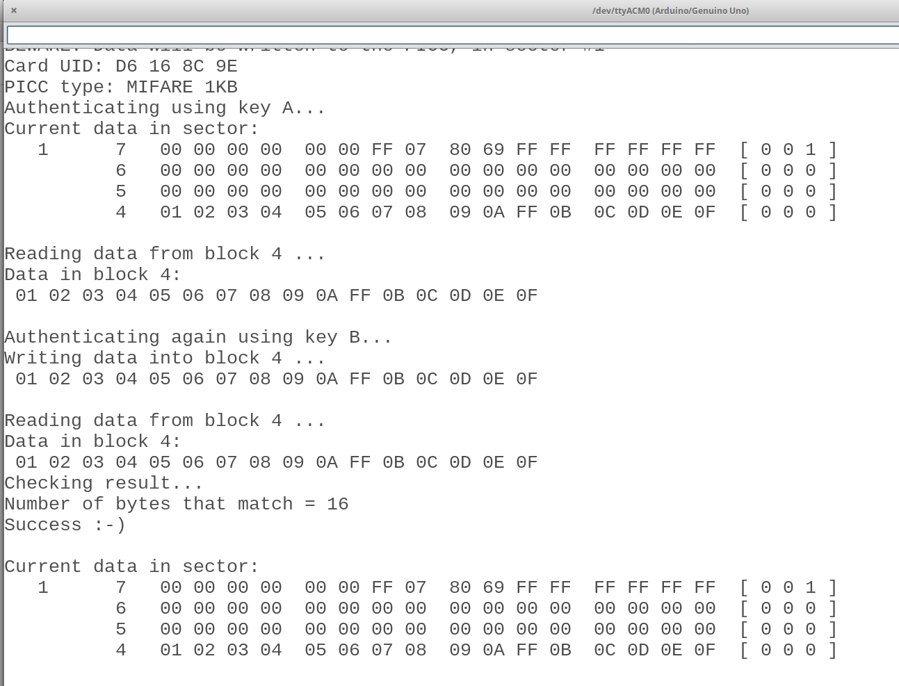

# Arduino: Nivel avanzado 3ed

## José Antonio Vacas @javacasm
## Organiza: [Darwin Eventur](https://www.darwineventur.com/2019/07/arduino-avanzado-3a-edicion.html)
## BiblioMaker - Facultad de Ciencias
## 23 al 27 de Septiembre de 2019

## http://bit.ly/ArduinoAvanzado19

## Uso de RFIDs

El sistema RFID está pensado para permitir la lectura de etiquetas a distancia sin establecer contato físico entre el lector y la etiqueta.

Las hay de corta distancia como las NFC, de media distancia como las de los sistemas antirrobo de los comercios (los aparatos que hay en la salidas son enormes antenas) y de larga distancia, como las que se usan en los parkings de los aeropuertos para reconocer los vehículos autorizados o en los autobuses para detectar que están en una parada.

El sistema está formador por un lector/emisor de radiofrecuencia que incluye una antena (que puede ser de mayor o menor tamaño)

y unas etiquetas (Tags) que son de diferentes formatos, según la frecuencia a la que funcionan y de la cantidad de información que permiten almacenar. Vemos que todas las etiquetas tienen un circuito que actua como antena receptora, con una frecuencia determinada para la que resuena

El emisor genera un señal de radiofrecuencia que la etiqueta recibe generando un eco que es leído por el lector.

Algunas tarjetas permiten la escritura, pudiendo guardar información en ellas (alrededor de 1KB)

### Montaje

El montaje es sencillo y sólo necesita el lector de RFIDs, un arduino y 7 cables macho-hembra. Para conectarlos seguimos el típico esquema de conexión de un dispositivo SPI:

|Lector RFID|arduino
|---|---|
|Sda   | 10
|Sck    | 13
|Mosi |  11
|Miso |  12
|||
|GND | GND
|Rst    |    9
|3.3V|3.3V

### Programación

Para este tipo de lectores usaremos la librería MFRC522 que podemos instalar desde el gestor de librerías de Arduino.

Una vez instalada tendremos ejemplos para hacer todas las funciónes disponibles:

* Ejemplo ReadNUID: lee el ID de la tarjeta y lo muestra

  

* Ejemplo DumpInfo: lee toda la información de la tarjeta y la envía al monitor serie

  
* Ejemplo ReadAndWrite: lee la información y cambia el bloque 4 escribiendo 0, 1,2, ... 15 en él

  

En [este vídeo](https://youtu.be/suunQECfMM8) hablamos de RFIDs.

### Referencias

[Tutorial de Luis Llamas](https://www.luisllamas.es/arduino-rfid-mifare-rc522/)

El ejemplo de "Valida Tarjeta" no es correcto, falta copiar lo leído y comparar con ese valor leído
