## Comunicaciones Wifi con  ESP8266

El ESP8266 es una pequeña placa diseñada por [Espressif](https://www.espressif.com) para proporcionar conectividad Wifi a microcontroladores. Se controla vía serie usando comandos AT (como los Modem, y lo teléfonos GPRS y GSM)

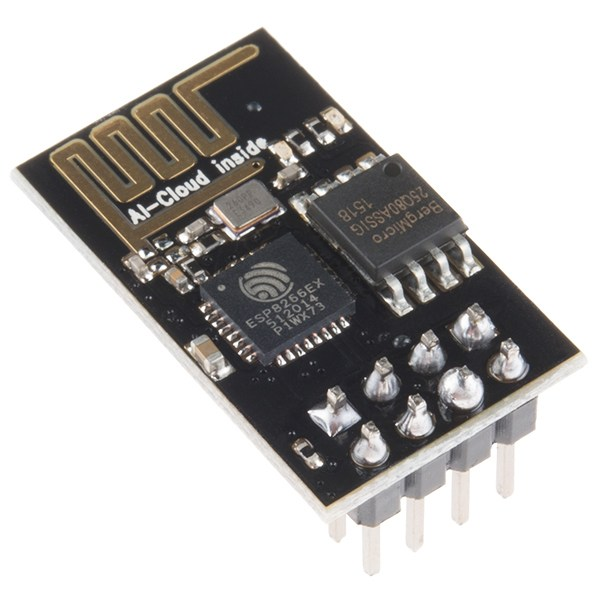

La placa dispone sólo de 8 patillas:
* GND
* Vcc que debe ser de 3.3V
* TX  para comunicaciones
* RX para comunicaciones
* EXT_RSTB reset
* CH_EN Enabled
* GPIO01 Disponible para programación
* GPIO02 Disponible para programación

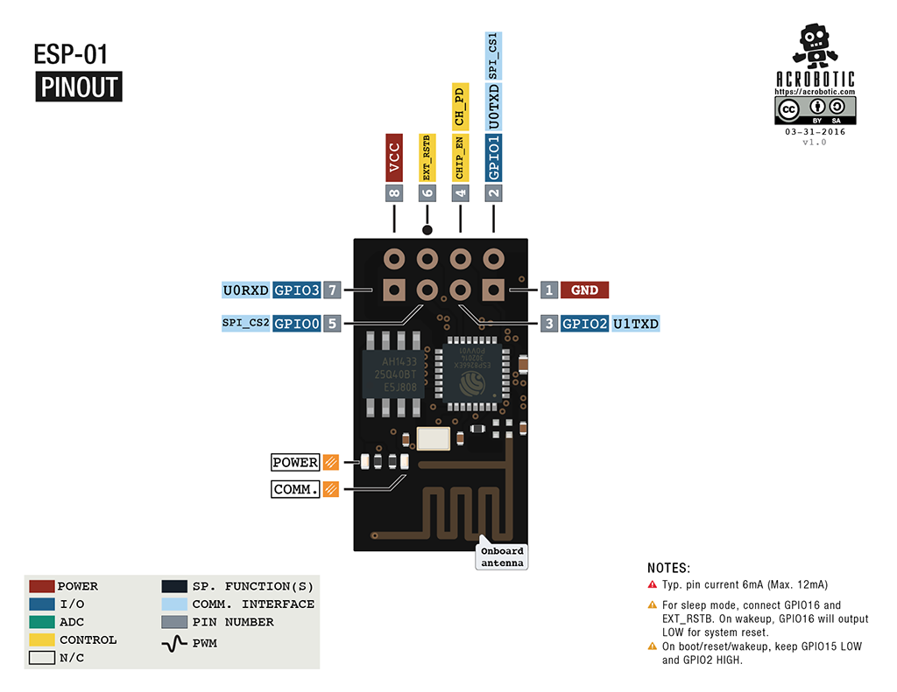

Como vemos la placa funciona a 3.3V pero parece ser tolerante a 5V (al menos no se daña directamente con conectar a las patillas de Arduino)

Como vemos las patillas no están pensadas para usar en protoboard, para conectarlo podemos usar un adaptador como estos que existen o construirlo nosotros mismos con 2 gurpos de 4 pines hembra de patilla larga

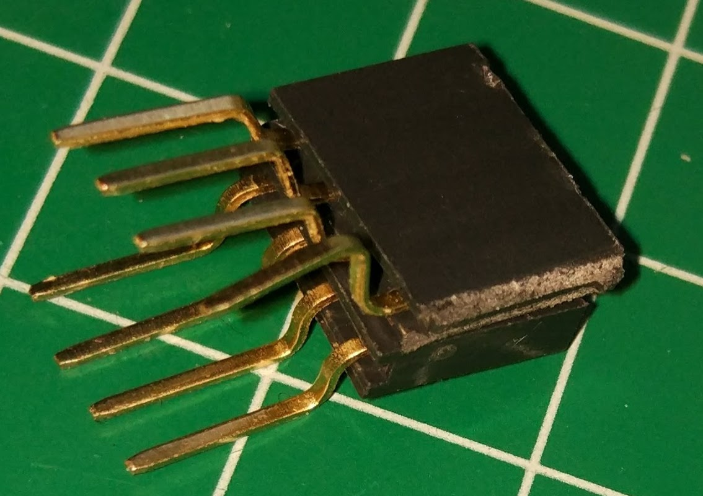

O comprando un adaptador como este otro

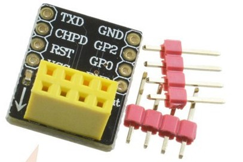

Hemos hecho este montaje

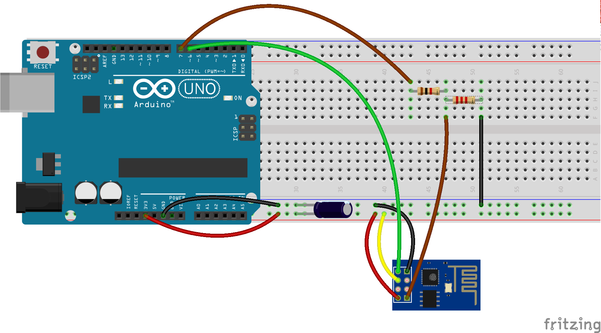

Utilizando un divisor de tensión para el pin RX del ESP8266 utilizando una resistencia de 1KΩ y otra de 2.2KΩ de manera que el voltaje que reciva el ESP sea aproximadamente de 3.3V (Si no tenéis resistencias de 2.2KΩ podéis usar 2 de 1KΩ en serie)

Lo hemos alimentado del pin 3.3V de Arduino y funciona bien, pero podríamos tener problemas si usamos el wifi de manera intensiva pues esta salida da poca intensidad. En caso de necesitarlo habría que usar una alimentación externa de 3.3V conectando su GND con el de Arduino.

Para evitar estos problemas de alimentación hemos incluido un condensador de 100microFaradios que contribuye a estabilizar la alimentación.

### Programación

Como hemos dicho tendríamos que usar comandos AT para comunicarnos con el ESP8266 que enviamos por su puerto serie para configurarlo, aquí tenéis el [listado de todos ellos](https://www.espressif.com/sites/default/files/documentation/4a-esp8266_at_instruction_set_en.pdf)

Una forma más sencilla de hacerlos es usando una librería que haga el trabajo dificil por nosotros.

Instalaremos la librería WifiESP desde su repositorio https://github.com/JiriBilek/WiFiEsp descargamos el fichero Zip y lo incorporamos en el entorno desde la opción "Añadir librería desde ZIP" en el menú Programa -> Incluir librería

Una vez importada tendremos sus ejemplos y los usaremos para poner a punto nuestro ESP y la comunicación con Arduino

Abrimos primero "test->ESPDebug" que nos permitirá enviar directamente comandos AT para ver que todo va OK. Lo subimos a nuestro Arduino y abrimos el monitor serie. Escribimos AT

Si recibimos OK de respuesta, ESP8266 está configurado a 9600baudios y podemos pasar a usar los siguientes ejemplos.

Si recibimos unos caracteres extraños

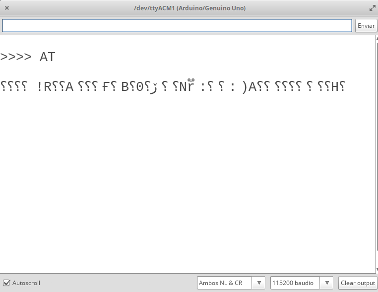

Para configurarlo a la velocidad correcta enviamos lo siguiente

    AT+UART_DEF=9600,8,1,0,0

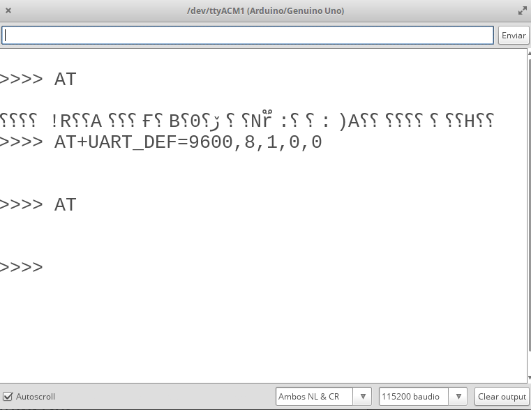

y reseteamos todo, apagando y encendiendo

Ahora al enviar AT recibimos OK

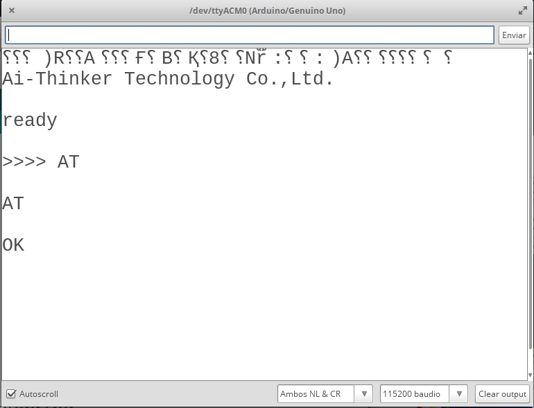

Ya lo tenemos listo para usarlo.

Empezaremos con el ejemplo WebServer, al que cambiaremos el SSID y el password por los de nuestro wifi. En el monitor serie veremos la ip que tiene y podremos conectarnos con un navegador

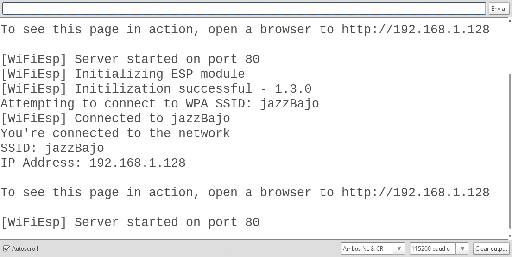

Nos conectamos y vemos la web

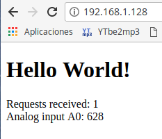

Si analizamos el código vemos que lo que hace es enviar el HTML de la página mediente llamadas client.print("...") y en medio incluye el valor de la lectura analógica

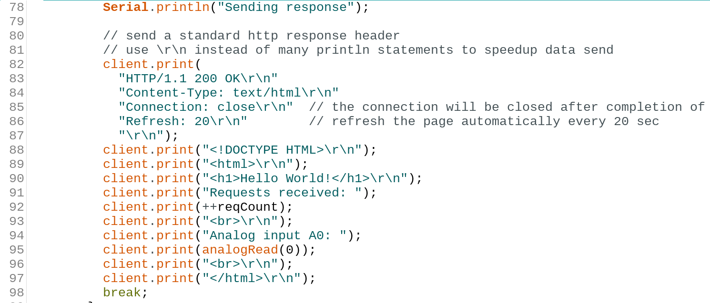

Vamos a usar ahora el ejemplo WebServerLed que nos permite controlar el estado de un led vía web

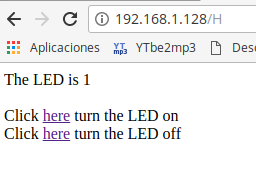

Donde vemos que según pulsemos un enlace u otro se activa o desacticva el led del pin 13. El "truco" ahora es generar unos enlaces para apagar o encender

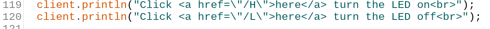

Y al recibir una petición se comprueba si viene de H o L

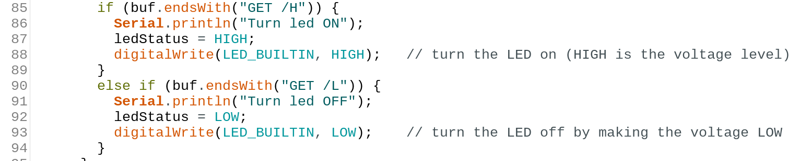

En [este vídeo](https://youtu.be/jYqKn6dhgJo) vemos todo el proceso de configuración el uso de los ejemplos.

### ¿Qué más podemos hacer con un ESP8266?

Internamente este pequeño ESP8266 tiene un micropocesador de 32 bits (necesario para implementar WPA) funcionando a 80MHz (y que puede hacerlo a 160MHz) y con 32 Kb de memoria de instrucciones y 80KB  de datos de usuario ([Especificiaciones](https://en.wikipedia.org/wiki/ESP8266))

Con estas características es una pena usarlo sólo para comunicaciones....

Si en lugar de usar esta pequeña placa donde la mayoría de los pines no están conectados al exterior lo usamos en un formato mayor como es el ESP12 en una placa NodeMCU tiene sentido eliminar Arduino y hacer todo el trabajo en esta placa

Pero eso será tema para otro curso...

### Referencias

Os recomiendo esta [estupenda entrada sobre la conexión con ESP8266 de Luis Llamas](https://www.luisllamas.es/arduino-wifi-esp8266-esp01/)
